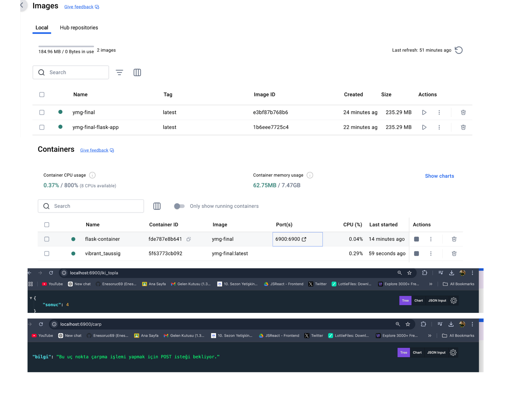

# Flask Uygulaması için Docker ve Docker Compose

Bu proje, Flask kullanılarak geliştirilmiş bir REST API uygulamasıdır. Proje, Docker imajı oluşturularak container olarak çalıştırılabilir ve Docker Compose ile yönetilebilir.

---

## **1. Dockerfile ile Docker İmajı Oluşturma**

### Adımlar:

1. **Proje klasöründe bir `Dockerfile` oluşturulur**. Bu dosyanın içeriği şu şekilde olmalıdır:

    ```dockerfile
    # Python tabanlı bir imaj 
    FROM python:3.9-slim

    # Çalışma dizinini oluştur ve ayarla
    WORKDIR /app

    # Gereken dosyaları kopyala
    COPY requirements.txt requirements.txt
    COPY app.py app.py

    # Flask bağımlılıklarını yükle
    RUN pip install --no-cache-dir -r requirements.txt

    # Flask uygulamasını çalıştır
    CMD ["python", "app.py"]
    ```

2. **`requirements.txt` oluşturulur**: Projenin bağımlılıklarını içeren bir dosya.

    ```plaintext
    flask
    flask-restful
    ```

3. **Docker imajını oluşturun**: Terminalde şu komut çalıştırılır:

    ```bash
    docker build -t flask-app .
    ```

---

## **2. Docker Container ile Uygulamayı Çalıştırma**

### Adımlar:

1. **Container'ı başlatmak için şu komutu çalıştırın**:

    ```bash
    docker run -d -p 6900:6900 flask-app
    ```

   - `-d`: Container'ı arka planda çalıştırır.
   - `-p 6900:6900`: Host ve container portlarını eşleştirir.

2. **Uygulamanın çalıştığını kontrol edin**:

   Tarayıcınızda şu URL'lere giderek kontrol edebilirsiniz:
   - `http://localhost:6900/iki_topla`
   - `http://localhost:6900/carp`

   Çalışıyorsa, JSON formatında bir yanıt alırsınız.

---

## **3. Docker Compose ile Uygulamayı Çalıştırma**

### Adımlar:

1. Proje klasörünüzde bir `docker-compose.yaml` dosyası oluşturun ve aşağıdaki içeriği ekleyin:

    ```yaml
    version: '3.8'
    services:
      flask-app:
        build:
          context: .
          dockerfile: Dockerfile
        ports:
          - "6900:6900"
        volumes:
          - .:/app
        command: ["python", "app.py"]
    ```

2. Docker Compose kullanarak container'ı başlatın:

    ```bash
    docker-compose up -d
    ```

3. Çalıştığını kontrol etmek için yine şu URL'lere gidilebilir:
   - `http://localhost:6900/iki_topla`
   - `http://localhost:6900/carp`

---

## **Container'ın Durdurulması**

Container'ı durdurmak için şu komutları kullanabilirsiniz:

- Docker ile:
  ```bash
  docker stop <container_id>
 ```


  
# restfull-Docker
